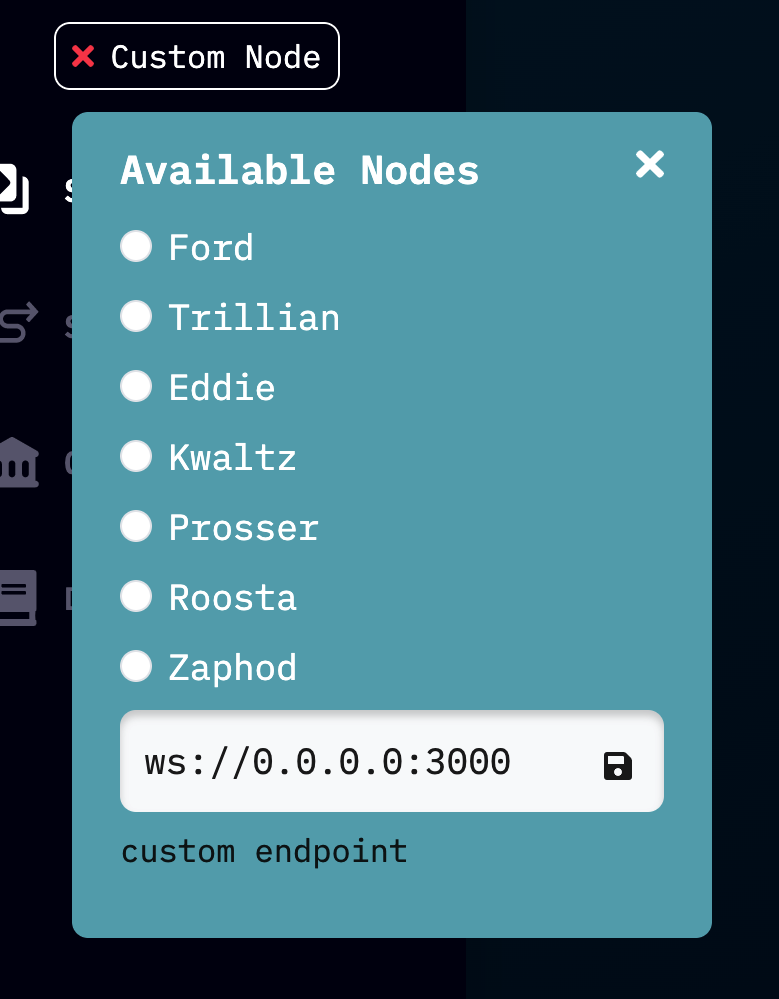

# Manual Test

To prepare for this test, you should have an up-to-date version of `manta-signer` desktop app, a local or remote Dolphin testnet, and a local or remote `manta-front-end` UI. See top level README.md for more details. 

To prepare for the test, you should create two accounts in polkadot.js browser extension. Load these accounts with balances of Dolphin and at least two parachain assets. If you are running a local testnet, you can mint assets to these accounts from the default sudo account (Alice) in [polkadot.js apps wallet](https://polkadot.js.org/apps) using the `assetManager.mintAsset` extrinsic. If you are testing against the live testnet, you can use the `#dolphin-faucet` channel in the Manta/Calamari public discord. 

For these three asset types, do all of the actions listed below (grouped by theme) at least twice (more is okay), in a random order (so at least six times total). Some bugs may only surface through an unusual sequence of actions, so it is important that actions are not performed in the exact order listed. 

- [] Manual test for Dolphin
- [] Manual test for some second parachain asset
- [] Manual test for some third parachain asset 

For each asset: 

### Transactions 
After each transaction, check that all balances displayed are as expected 

- deposit to private from public account 1
    - [ ]
    - [ ]
- deposit to private from public account 2
    - [ ]
    - [ ]
- public transfer from public account 1 to public account 2
    - [ ]
    - [ ]
- public transfer from public account 2 to public account 1
    - [ ]
    - [ ]
- public transfer from public account 1 to an external public address like `5F9cg3A63oPJp5VL4Xry76HMWSMpX38YRMof5wiCfwZuo7zZ`
    - [ ]
    - [ ]
- private transfer to your own private address
    - [ ]
    - [ ]
- private transfer to an external private address like `4zzkcPhcM9WwNybDSd2BScPQTx3K3D578ri75dJgPjS9M2gaJH2QALpBwThajzzGA4QsDhhAtiyLvhsTGN5Dkqxn`
    - [ ]
    - [ ]
- reclaim from private to public account 1
    - [ ]
    - [ ]
- reclaim from private to public account 2
    - [ ]
    - [ ] 

### Validations 
A transaction that fails one of these validations should not even prompt a loading spinner 

- try to send more than available balance
    - [ ]
    - [ ]
- try to send to an invalid public account (a private address or a nonsense string)
    - [ ]
    - [ ]
- try to send to an invalid private account (a public address or a nonsense string)
    - [ ]
    - [ ]
- click the `send max` button and check amount is reasonable
    - [ ]
    - [ ] 

### Connection 
After reconnection or refresh, balances should remain the same 

- close and reopen Signer desktop app
    - [ ]
    - [ ]
- refresh page
    - [ ]
    - [ ]
- disconnect and reconnect from your Dolphin node.
    -  You force a disconnect by connecting to some fake websocket like `ws://0.0.0.0:3000`
    - [ ]
    - [ ]
 

## Gotchas
- No balances is allowed to go below the existential deposit during any transaction. It is expected that UI should not allow such transactions to process. For example, transfering 10 DOL from an account that contains 10 DOL is invalid.
